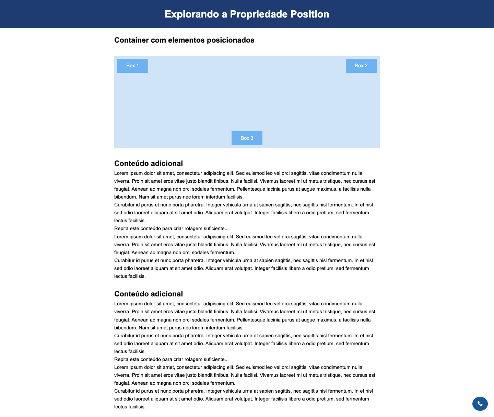
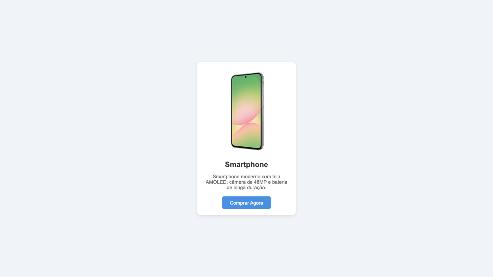

## 📝 Exercícios 

---

### 🔹 Exercício 1 - Box Model
**Descrição:** Você foi convidado para colaborar com o layout de um portal fictício de notícias de tecnologia chamado **TecNews**. O objetivo é criar uma estrutura visual simples e organizada, utilizando os princípios do **Box Model** no CSS.

Abaixo está o **modelo de referência** do layout. Seu desafio é **replicar exatamente esse resultado** a partir do código fornecido:

`index.html`
```html
<!DOCTYPE html>
<html lang="pt-br">

<head>
  <meta charset="UTF-8">
  <title>TecNews - Destaques</title>
  <link rel="stylesheet" href="style.css">
</head>

<body>
  <div class="container">
    <header>
      <h1>TecNews</h1>
      <p>As principais notícias de tecnologia do dia.</p>
    </header>
    <main>
      <section class="noticia">
        <h2>Nova IA da OpenAI promete revolucionar o ensino</h2>
        <p>A OpenAI anunciou hoje um novo modelo de inteligência artificial voltado para educação. A ferramenta
            será capaz de adaptar conteúdos de acordo com o nível de conhecimento do aluno.</p>
      </section>

      <section class="noticia">
        <h2>Computadores quânticos avançam mais um passo</h2>
        <p>Pesquisadores alcançam um novo marco no desenvolvimento de computadores quânticos, prometendo
            mudanças radicais na área da criptografia.</p>
      </section>
    </main>

    <footer>
      <p>&copy; 2025 TecNews - Todos os direitos reservados</p>
    </footer>
  </div>
</body>

</html>
```

<br>

#### O que seu código deve conter
- Um seletor universal `*` para fazer o reset de `margin`, `padding` e aplicar `box-sizing: border-box`;

* Aplicação das propriedades do Box Model como `border`, `margin`, `padding` e `border-radius`;

- Uma estrutura com `<header>`, `<main>` com duas notícias, e `<footer>`, todos estilizados com bordas, espaçamentos internos e externos;

* Um container centralizado com **largura máxima** de `600px`.

<br>

#### Resultado Esperado


---

### 🔹 Exercício 2 – Posicionando Elementos
**Descrição:** Neste exercício, você vai praticar os diferentes valores da propriedade `position`:

- **relative** e **absolute** para posicionar elementos dentro de um container.
- **fixed** para manter um link de contato fixo no canto inferior direito da página.
- **sticky** para deixar o cabeçalho sempre visível no topo ao rolar a página.

Ao final, você terá uma página funcional e estilizada, explorando como o posicionamento afeta a disposição dos elementos na tela.

**Código Base (HTML):**
```html
<!DOCTYPE html>
<html lang="pt-br">
<head>
  <meta charset="UTF-8">
  <meta name="viewport" content="width=device-width, initial-scale=1.0">
  <title>Propriedade Position</title>
  <link rel="stylesheet" href="style.css">
  <link rel="stylesheet" href="https://cdnjs.cloudflare.com/ajax/libs/font-awesome/7.0.0/css/all.min.css" integrity="sha512-DxV+EoADOkOygM4IR9yXP8Sb2qwgidEmeqAEmDKIOfPRQZOWbXCzLC6vjbZyy0vPisbH2SyW27+ddLVCN+OMzQ==" crossorigin="anonymous" referrerpolicy="no-referrer" />
</head>
<body>
  
  <header>
    <h1>Explorando a Propriedade Position</h1>
  </header>

  <main>
    <section>
      <h2>Container com elementos posicionados</h2>
      <div class="container">
        <div class="box box1">Box 1</div>
        <div class="box box2">Box 2</div>
        <div class="box box3">Box 3</div>
      </div>
    </section>

    <section>
      <h2>Conteúdo adicional</h2>
      <p>Lorem ipsum dolor sit amet, consectetur adipiscing elit. Sed euismod leo vel orci sagittis, vitae condimentum nulla viverra. Proin sit amet eros vitae justo blandit finibus. Nulla facilisi. Vivamus laoreet mi ut metus tristique, nec cursus est feugiat. Aenean ac magna non orci sodales fermentum. Pellentesque lacinia purus at augue maximus, a facilisis nulla bibendum. Nam sit amet purus nec lorem interdum facilisis.</p>
      <p>Curabitur id purus et nunc porta pharetra. Integer vehicula urna at sapien sagittis, nec sagittis nisl fermentum. In et nisl sed odio laoreet aliquam at sit amet odio. Aliquam erat volutpat. Integer facilisis libero a odio pretium, sed fermentum lectus facilisis.</p>
      <p>Repita este conteúdo para criar rolagem suficiente...</p>
      <p>Lorem ipsum dolor sit amet, consectetur adipiscing elit. Sed euismod leo vel orci sagittis, vitae condimentum nulla viverra. Proin sit amet eros vitae justo blandit finibus. Nulla facilisi. Vivamus laoreet mi ut metus tristique, nec cursus est feugiat. Aenean ac magna non orci sodales fermentum.</p>
      <p>Curabitur id purus et nunc porta pharetra. Integer vehicula urna at sapien sagittis, nec sagittis nisl fermentum. In et nisl sed odio laoreet aliquam at sit amet odio. Aliquam erat volutpat. Integer facilisis libero a odio pretium, sed fermentum lectus facilisis.</p>
    </section>

    <br>

    <section>
      <h2>Conteúdo adicional</h2>
      <p>Lorem ipsum dolor sit amet, consectetur adipiscing elit. Sed euismod leo vel orci sagittis, vitae condimentum nulla viverra. Proin sit amet eros vitae justo blandit finibus. Nulla facilisi. Vivamus laoreet mi ut metus tristique, nec cursus est feugiat. Aenean ac magna non orci sodales fermentum. Pellentesque lacinia purus at augue maximus, a facilisis nulla bibendum. Nam sit amet purus nec lorem interdum facilisis.</p>
      <p>Curabitur id purus et nunc porta pharetra. Integer vehicula urna at sapien sagittis, nec sagittis nisl fermentum. In et nisl sed odio laoreet aliquam at sit amet odio. Aliquam erat volutpat. Integer facilisis libero a odio pretium, sed fermentum lectus facilisis.</p>
      <p>Repita este conteúdo para criar rolagem suficiente...</p>
      <p>Lorem ipsum dolor sit amet, consectetur adipiscing elit. Sed euismod leo vel orci sagittis, vitae condimentum nulla viverra. Proin sit amet eros vitae justo blandit finibus. Nulla facilisi. Vivamus laoreet mi ut metus tristique, nec cursus est feugiat. Aenean ac magna non orci sodales fermentum.</p>
      <p>Curabitur id purus et nunc porta pharetra. Integer vehicula urna at sapien sagittis, nec sagittis nisl fermentum. In et nisl sed odio laoreet aliquam at sit amet odio. Aliquam erat volutpat. Integer facilisis libero a odio pretium, sed fermentum lectus facilisis.</p>
    </section>
  </main>

  <a href="#" class="contato-fixo"><i class="fa-solid fa-phone"></i></a>

</body>
</html>
```

<br>

**Código Base (CSS):**
```css
* {
  margin: 0;
  padding: 0;
  box-sizing: border-box;
}

body {
  font-family: Arial, sans-serif;
  line-height: 1.6;
}

header {
  background-color: #1e3c72;
  color: white;
  padding: 20px;
  text-align: center;
}

main {
  max-width: 900px;
  margin: auto;
  padding: 20px;
}

.container {
  background-color: #d0e4f7;
  height: 300px;
  margin: 30px 0;
}

.box {
  background-color: #6db3f2;
  color: white;
  padding: 10px;
  width: 100px;
  text-align: center;
}

.box1 {

}

.box2 {

}

.box3 {

}

.contato-fixo {
  background-color: #1a5798;
  color: white;
  padding: 10px 15px;
  text-decoration: none;
  border-radius: 50%;
}
```

<br>

**Resultado Esperado:**



<br>

**Instruções:**
**1. Header fixo com `sticky`**

- Mantenha o cabeçalho no topo ao rolar a página usando `position: sticky`.
- Lembre-se de definir `top: 0` e usar `z-index` para que ele fique sobre os outros elementos.

**2. Container com elementos posicionados**

- Crie um div container com `position: relative`.
- Dentro dele, adicione três elementos com `position: absolute`, cada um em posições diferentes (`top`, `left`, `right`, `bottom`).

**3. Botão de contato fixo**

- Adicione um botão ou link no canto inferior direito da página usando `position: fixed`.

---

### 🔹 Exercício 3 – Centralizando um Card de Produto
**Descrição:** Neste exercício, você vai praticar a centralização de um card de produto na tela. O objetivo é posicionar esse card exatamente no centro da tela, tanto na horizontal quanto na vertical, independentemente do tamanho da viewport.

**Código Base (HTML):**
```html
<!DOCTYPE html>
<html lang="pt-br">
<head>
  <meta charset="UTF-8" />
  <meta name="viewport" content="width=device-width, initial-scale=1" />
  <title>Card de Produto Centralizado</title>
  <link rel="stylesheet" href="style.css" />
</head>
<body>
  <div class="pai">
    <div class="card-produto">
      
      <h2>Smartphone</h2>
      <p>Smartphone moderno com tela AMOLED, câmera de 48MP e bateria de longa duração.</p>
      <button>Comprar Agora</button>
    </div>
  </div>
</body>
</html>

```

<br>

**Código Base (CSS):**
```css
html, body {
  height: 100%;
  margin: 0;
  font-family: Arial, sans-serif;
}

.pai {
  height: 100vh;
  background-color: #f0f4f8;
}

.card-produto {
  width: 320px;
  background-color: white;
  border-radius: 12px;
  box-shadow: 0 4px 10px rgba(0,0,0,0.1);
  padding: 20px;
  box-sizing: border-box;
  text-align: center;
}

.card-produto img {
  width: 100%;
  border-radius: 8px;
  margin-bottom: 15px;
}

.card-produto h2 {
  margin: 0 0 10px;
  font-size: 24px;
  color: #333;
}

.card-produto p {
  font-size: 16px;
  color: #666;
  margin-bottom: 20px;
}

.card-produto button {
  background-color: #4a90e2;
  color: white;
  border: none;
  padding: 12px 25px;
  font-size: 16px;
  border-radius: 6px;
  cursor: pointer;
  transition: background-color 0.3s ease;
}

.card-produto button:hover {
  background-color: #357abd;
}
```

<br>

**Resultado Esperado:**



<br>

**Instruções:**
**1. Centralize o card na tela usando:**

- `position: absolute;`
- `top: 50%; left: 50%;`
- `transform: translate(-50%, -50%);`

**2. Use um elemento pai com `position: relative` para que o posicionamento absoluto funcione corretamente.**

---