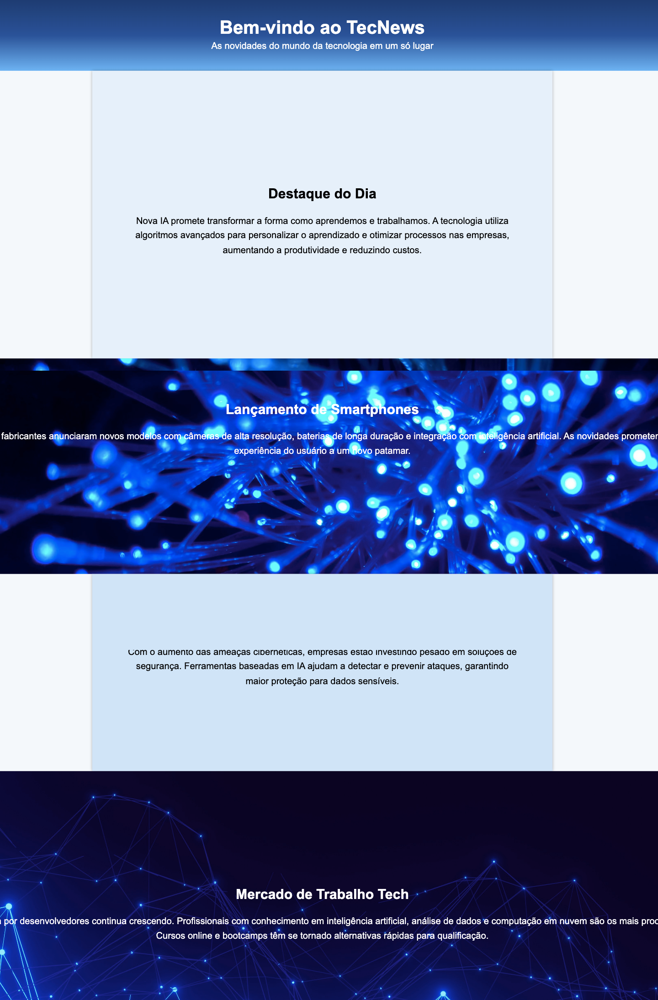
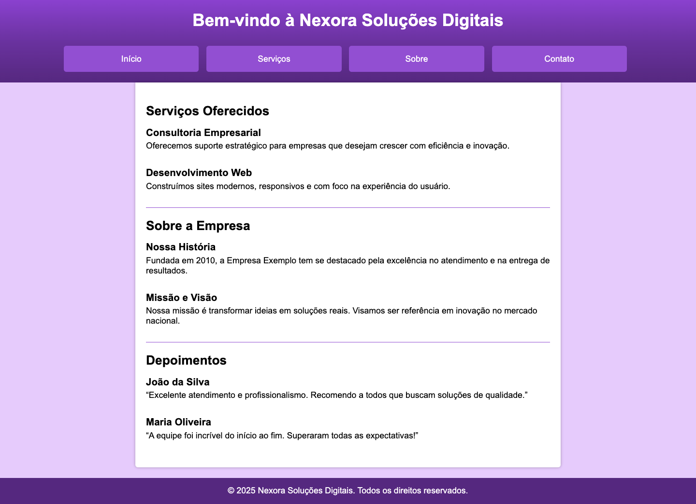

## 📝 Exercícios 

---

### 🔹 Exercício 1 – Personalizando o Fundo
**Descrição:** Você irá praticar a personalização do fundo de algumas seções de um site usando as propriedades relacionadas a **background**: `background-color`, `background-image`, `background-position`, `background-repeat`, `background-size`, `background-attachment` e a `shorthand`. E aplicará também um gradiente.

**Código Base (HTML):**
```html
<!DOCTYPE html>
<html lang="pt-BR">
<head>
  <meta charset="UTF-8">
  <title>TecNews</title>
  <link rel="stylesheet" href="style.css">
</head>
<body>
  <header>
    <h1>Bem-vindo ao TecNews</h1>
    <p>As novidades do mundo da tecnologia em um só lugar</p>
  </header>

  <section class="destaque">
    <h2>Destaque do Dia</h2>
    <p>Nova IA promete transformar a forma como aprendemos e trabalhamos.</p>
  </section>
</body>
</html>
```

<br>

**Código Base (CSS):**
```css
* {
  margin: 0;
  padding: 0;
  box-sizing: border-box;
}

body {
  font-family: Arial, sans-serif;
}

header {
  text-align: center;
  padding: 30px;
  color: white;
}
/* primeira seção */
main section:nth-child(1) {

}
/* segunda seção */
main section:nth-child(3) {

}

section {
  height: 500px;
  text-align: center;
  padding: 200px 60px 0;
}

h2 {
  margin-bottom: 20px;
}

p {
  line-height: 1.6;
}

.center-section {
  max-width: 800px;
  width: 80%;
  margin: 0 auto;
  box-shadow: 0px 0px 5px rgba(0, 0, 0, 0.3);
}

.section-full-parallax {

}

.section-full {
  
}

footer {
  text-align: center;
  padding: 20px;
  color: white;
}
```

<br>

**Resultado Esperado:**




<br>
<br>

**Instruções:**
- Defina a cor de fundo da página inteira como `#f4f8fb`.
- Aplique um gradiente linear no cabeçalho utilizando três cores. Por exemplo: `#1e3c72`, `#2a5298` e `#6db3f2`.
- Defina cores sólidas de fundo para as seções: seção 1 → `#e6f0fa` e seção 3 → `#d0e4f7`

- Para as seções 2 e 4:

  - Adicione uma imagem de fundo utilizando as propriedades corretas de background.
  - Centralize a imagem.
  - Aplique o efeito parallax (apenas para a seção 2).

- No rodapé, aplique um fundo sólido `#1a5798`.

As cores acima são sugestivas, você pode usar as cores que quiser e criar o seu próprio estilo para a página.

---

### 🔹 Exercício 2 – Organizando Menu Horizontal
**Descrição:** Você está desenvolvendo o site da empresa fictícia Nexora Soluções Digitais. O layout já está quase pronto, mas o menu de navegação no cabeçalho ainda está sem estilo. Seu desafio é transformar a lista de links da navegação em um menu horizontal, bem distribuído e visualmente agradável, de acordo com o design da página.

**Código Base (HTML):**
```html
<!DOCTYPE html>
<html lang="pt-br">
<head>
  <meta charset="UTF-8">
  <meta name="viewport" content="width=device-width, initial-scale=1.0">
  <title>Nexora Soluções Digitais</title>
  <link rel="stylesheet" href="style.css">
</head>
<body>
  <header>
    <h1>Bem-vindo à Nexora Soluções Digitais</h1>
    <nav>
      <ul>
        <li><a href="#">Início</a></li>
        <li><a href="#">Serviços</a></li>
        <li><a href="#">Sobre</a></li>
        <li><a href="#">Contato</a></li>
      </ul>
    </nav>
  </header>

  <main>
    <section>
      <h2>Serviços Oferecidos</h2>

      <article>
        <h3>Consultoria Empresarial</h3>
        <p>Oferecemos suporte estratégico para empresas que desejam crescer com eficiência e inovação.</p>
      </article>

      <article>
        <h3>Desenvolvimento Web</h3>
        <p>Construímos sites modernos, responsivos e com foco na experiência do usuário.</p>
      </article> 
    </section>

    <div class="divisao"></div>
    
    <section>
      <h2>Sobre a Empresa</h2>
      <article>
        <h3>Nossa História</h3>
        <p>Fundada em 2010, a Empresa Exemplo tem se destacado pela excelência no atendimento e na entrega de resultados.</p>
      </article>

      <article>
        <h3>Missão e Visão</h3>
        <p>Nossa missão é transformar ideias em soluções reais. Visamos ser referência em inovação no mercado nacional.</p>
      </article>
    </section>

    <div class="divisao"></div>

    <section>
      <h2>Depoimentos</h2>
      <article>
        <h3>João da Silva</h3>
        <p>“Excelente atendimento e profissionalismo. Recomendo a todos que buscam soluções de qualidade.”</p>
      </article>

      <article>
        <h3>Maria Oliveira</h3>
        <p>“A equipe foi incrível do início ao fim. Superaram todas as expectativas!”</p>
      </article>
    </section>
  </main>

  <footer>
    <p>&copy; 2025 Nexora Soluções Digitais. Todos os direitos reservados.</p>
  </footer>
</body>
</html>
```

<br>

**Código Base (CSS):**
```css
* {
  margin: 0;
  padding: 0;
  box-sizing: border-box;
}

html {
  font-family: Arial, Helvetica, sans-serif;
}

body {
  background-color: #e6cbff;
}

header {
  background: linear-gradient(180deg, #8a41cf, #6a329f, #55287f);
  padding: 20px;
  color: white;
  text-align: center;
}

header h1 {
  margin-bottom: 30px;
}

/* Adicione o CSS aqui */

main {
  background-color: white;
  max-width: 800px;
  margin: 0 auto;
  box-shadow: 0px 0px 5px rgba(0, 0, 0, 0.3);
  padding: 20px;
  border-bottom-left-radius: 5px;
  border-bottom-right-radius: 5px;
  margin-bottom: 20px;
}

h2 {
  margin: 20px 0 10px 0;
}

h3 {
  margin: 15px 0 5px 0;
}

.divisao {
  width: 100%;
  height: 1px;
  background-color: #924fd2;
  margin: 20px 0;
}

article {
  margin-bottom: 30px;
}

footer {
  background-color: #55287f;
  padding: 15px;
  color: white;
  text-align: center;
}
```

<br>

**Resultado Esperado:**



<br>
<br>

**Instruções:**
- Para tirar os marcadores da lista, use `list-style-type: none`.
- Para exibir os itens lado a lado, você pode usar `display: inline-block`.
- Adicione espaçamento entre os links usando `margin`.
- Use `padding`, `background-color`, `border-radius` e `color` para estilizar os itens como botões.
- Define a largura com `width` usando uma unidade de medida **relativa**.
- Use `text-decoration: none` para remover o sublinhado dos links.

---